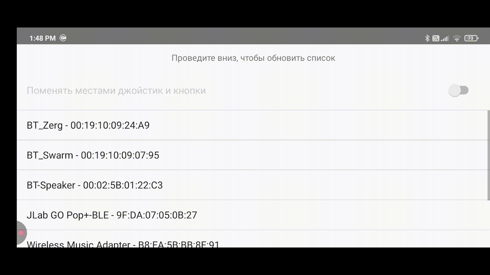
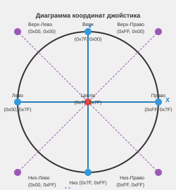

# Zerg_pad 
🇷🇺 [Русская версия](README_ru.md)
## Important

After downloading the project from GitHub, I recommend clicking the "Build" button so that all libraries in Android Studio are connected.

The project should work on Android 9–16; I only tested it on Android 10, 14 and 16.
The gif shows how to toggle controls for left-handed and right-handed users - this is also convenient for projects with simple directions: forward, back, left, right.

## Overview
**Zerg Pad** — universal Bluetooth controller with control elements for custom projects on Arduino, STM32, ESP32, etc.
* Virtual joystick with display of angle, power, and movement direction
* (, , , ), Left, Right, Select и Start - Control buttons for custom functions
* Event log display area for monitoring sent commands

### Joystick
The joystick transmits its position data in a 4-byte command format:

| Purpose   | Byte count | Format (HEX) | Description                                     |
|--------------|-------------|--------------|----------------------------------------------|
| Prefix      | 1 byte      | 0xF1         | Indicates that this is a command from the joystick     |
| Coordinate X | 1 byte      | 0x00–0xFF    | Horizontal position (0-255)             |
| Coordinate Y | 1 byte      | 0x00–0xFF    | Vertical position (0-255)               |
| Power     | 1 byte      | 0x00–0x64    | Press force (0-100%)                        |

> **Important:** Center position: X=127 (0x7F), Y=127 (0x7F), Power=0 (0x00)

### Joystick data transmission example
Any movement of the joystick sends a command in the format: `F1 XX YY PP`

| Action      | Bytes sent | Description                                  |
|---------------|--------------------|-------------------------------------------|
| Center (idle) | `F1 7F 7F 00`      | Joystick in neutral position          |
| Max up   | `F1 ~80 ~01 64`      | Maximum upward deflection       |
| Max down    | `F1 ~94 ~F9 64`      | Maximum downward deflection        |
| Max left   | `F1 ~03 ~7E 64`      | Maximum leftward deflection       |
| Max right  | `F1 ~FA ~7F 64`      | Maximum rightward deflection      |

Note: Coordinate values (XX, YY) at maximum joystick deflection may vary depending on the exact angle and touch point. This is normal behavior for virtual joysticks. The ~ symbol indicates approximate values. The power value (PP) at maximum deflection is always 100% (0x64).

### Control buttons
Pressing any button sends a 3-byte command:
| Purpose   | Byte count | Format (HEX) | Description                                     |
|--------------|-------------|--------------|----------------------------------------------|
| Prefix      | 1 byte      | 0xF0         | Indicates that this is a command from a button       |
| Button code   | 1 byte      | 0x01–0x08    | Unique code for each button                |
| State    | 1 byte      | 0x7F/0x00    | 0x7F=pressed, 0x00=released                 |

For example: 
- Pressing button : `F0 01 7F` 
- Releasing button : `F0 01 00`

| Button | ID in code | Button code |
|--------|-----------|------------|
|  | btn_a | 0x01 |
|  | btn_b | 0x02 |
|  | btn_x | 0x03 |
|  | btn_y | 0x04 |
| Select | btn_select | 0x05 |
| Start | btn_start | 0x06 |
| Left | btn_left | 0x07 |
| Right | btn_right | 0x08 |

### Library used
The project uses a modified version of the [JoystickView](https://github.com/alvesoaj/JoystickView) library to implement the virtual joystick

## Compatibility
Zerg Pad can be used in projects with:
- Arduino (via SoftwareSerial / Bluetooth HC-05)
- ESP32 (Serial Bluetooth Classic)
- STM32 (via UART Bluetooth HC-05)
- PC with Bluetooth (via virtual COM port)

### Download APK
The latest version of the application can be downloaded:

1. **Direct link** (right-click → "Save link as"):  
   [Zerg_pad.apk](https://github.com/zagotovka/Zerg_pad/raw/main/download_app/Zerg_pad.apk)

2. Or via the releases page (NOT YET IMPLEMENTED!):  
   [Releases page](https://github.com/zagotovka/Zerg_pad/releases/latest)

> When downloading via a mobile device browser, select "Save file" in the dialog box.
