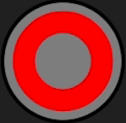

# Zerg_pad 
Проект должен работать на Android 9–15, проверял только на Android 10 и 14.


## Обзор
Zerg pad - пользовательский интерфейс с элементами управления.
* Виртуальный джойстик с отображением угла, мощности и направления
* Кнопки (, , , )
* Дополнительные кнопки Left и Right
* Кнопки Select и Start для навигации по меню
* Область отображения журнала событий

### Джойстик
| Параметр | Описание | Диапазон значений |
|----------|----------|-------------------|
| Угол (Angle) | Направление отклонения джойстика в градусах | 0-359° |
| Мощность (Power) | Степень отклонения джойстика | 0-100% |
| Направление (Direction) | Текстовое обозначение направления | Center, N, NE, E, SE, S, SW, W, NW |

### Пример передачи данных джойстика
```json
{
  "type": "joystick",
  "angle": 45,
  "power": 75,
  "direction": "NE"
}
```

### Кнопки управления
| Кнопка | ID в коде | Описание |
|--------|-----------|----------|
|  | btn_b | Верхняя кнопка (12 часов) |
|  | btn_y | Левая кнопка (9 часов) |
|  | btn_a | Правая кнопка (3 часа) |
|  | btn_x | Нижняя кнопка (6 часов) |
| Left | btn_left | Верхняя левая кнопка |
| Right | btn_right | Верхняя правая кнопка |
| Select | btn_select | Нижняя кнопка (меню) |
| Start | btn_start | Нижняя кнопка (запуск) |

### Пример передачи данных кнопок
```json
{
  "type": "button",
  "id": "circle",
  "action": "pressed"
}
```
### Используемая библиотека
В проекте используется библиотека [JoystickView](https://github.com/alvesoaj/JoystickView) для реализации виртуального джойстика.
