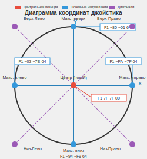

# Zerg_pad 

## Важно 
После скачивания проекта с GitHub рекомендую нажать кнопку "Build", чтобы подключились все библиотеки.

Проект должен работать на Android 9–15, проверял только на Android 10 и 14.
В гифке показано, как переключать управление для левшей и правшей - это также удобно для проектов с простыми направлениями: вперед, назад, влево, вправо.

## Обзор
Zerg pad - универсальный Bluetooth-контроллер с элементами управления для своих проектов на Arduino, STM32, ESP32 и т.п.
* Виртуальный джойстик с отображением угла, мощности и направления перемещения
* (, , , ), Left, Right, Select и Start - Кнопки управления для собственных функций
* Область отображения журнала событий для мониторинга отправляемых команд

### Джойстик
Джойстик передает данные о своем положении в формате 3-х байтовой команды:

| Назначение   | Кол-во байт | Формат (HEX) | Описание                                     |
|--------------|-------------|--------------|----------------------------------------------|
| Префикс      | 1 байт      | 0xFE         | Обозначает, что это команда от джойстика     |
| Координата X | 1 байт      | 0x00–0xFF    | Горизонтальное положение (слева–направо)     |
| Координата Y | 1 байт      | 0x00–0xFF    | Вертикальное положение (снизу–вверх)         |

> **Важно:** Диапазон координат от 0x00 до 0xFF (0-255), где 0x7F (127) — центральное положение.

### Пример передачи данных джойстика
Любое движение джойстика отправляет команду в формате: `FE XX YY`

| Действие      | Отправляемые байты | Описание                                  |
|---------------|--------------------|--------------------------------------------|
| Центр (покой) | `FE 7F 7F`         | Джойстик в нейтральном положении          |
| Вверх         | `FE 7F 00`         | Максимальное отклонение вверх              |
| Вниз          | `FE 7F FF`         | Максимальное отклонение вниз               |
| Влево         | `FE 00 7F`         | Максимальное отклонение влево              |
| Вправо        | `FE FF 7F`         | Максимальное отклонение вправо             |
| Вверх-вправо  | `FE FF 00`         | Диагональное отклонение вверх-вправо       |
| Вверх-влево   | `FE 00 00`         | Диагональное отклонение вверх-влево        |
| Вниз-вправо   | `FE FF FF`         | Диагональное отклонение вниз-вправо        |
| Вниз-влево    | `FE 00 FF`         | Диагональное отклонение вниз-влево         |

### Кнопки управления
Нажатие любой кнопки отправляет 2-байтную команду:
| Назначение   | Кол-во байт | Формат (HEX) | Описание                                     |
|--------------|-------------|--------------|----------------------------------------------|
| Префикс      | 1 байт      | 0xFF         | Обозначает, что это команда от кнопки     |
| Код кнопки | 1 байт      | 0x01–0x08    | Уникальный код каждой кнопки     |

Например: нажатие кнопки  отправит FF 01, кнопки Start — FF 06.

| Кнопка | ID в коде | команда |
|--------|-----------|----------|
|  | btn_b | FF 02 |
|  | btn_y | FF 04 |
|  | btn_a | FF 01 |
|  | btn_x | FF 03 |
| Left | btn_left | FF 07 |
| Right | btn_right | FF 08 |
| Select | btn_select | FF 05 |
| Start | btn_start | FF 06 |

### Используемая библиотека
В проекте используется библиотека [JoystickView](https://github.com/alvesoaj/JoystickView) для реализации виртуального джойстика.

### Скачать "Zerg_pad.apk" для Android v9-15
Что бы установить приложение на свой телефон не обязательно устанавливать Android Studio... Скачайте актуальную версию файла "Zerg_pad.apk" из папки 'download_app' проекта либо кликнув на [download_app](../../raw/main/download_app/Zerg_pad.apk).

